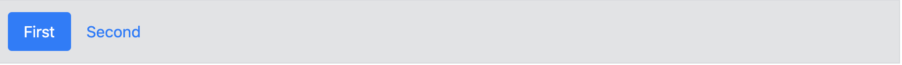
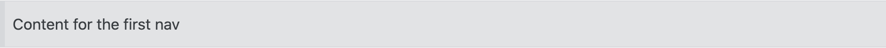
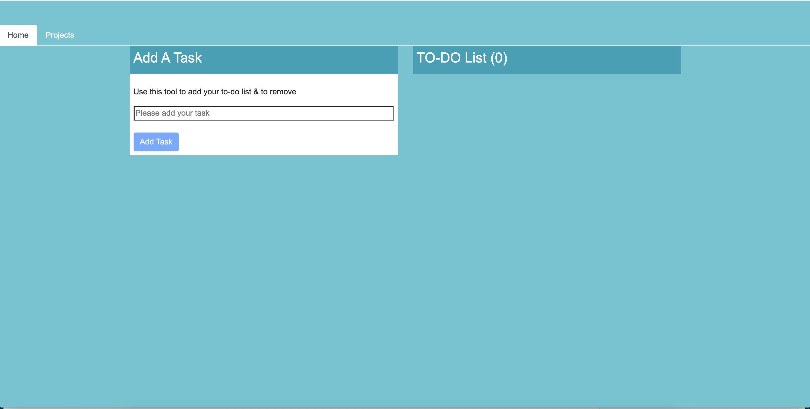
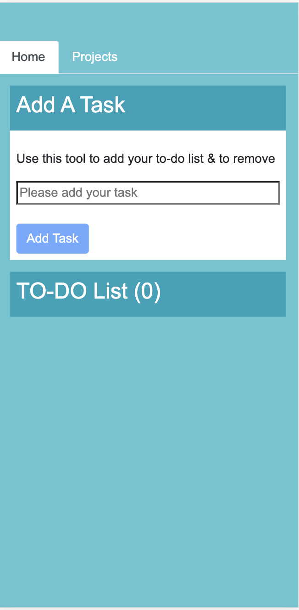

# Angular 9 ToDo App

## Description of Project
Created an Angular 9 app to demonstrate knowledge of the following:
- [(ngModel)]
- @Input() 
- @Output()
- *ngIf
- *ngFor
- (click)
- ng-bootstrap

Used ngbNavLink & ngbNavContent for navigating instead of routerLink.
## Basic Usage
Nav includes NgbNav, NgbNavItem, NgbNavLink, NgbNavContent directives and the NgbNavOutlet component.

These directives are fully based on the bootstrap markup leaving all DOM nodes available for you. They just handle nav selection, accessibility and basic styling for you. You can always add additional classes and behavior on top if necessary. Please refer to the bootstrap nav documentation for a complete set of classes you can use with navs.

The simplest nav would look something like a combination of styled links:



and an optional outlet, where the content related to the active nav would be displayed:



This example would look something along these lines (or better dive into one of the [working demos](https://ng-bootstrap.github.io/#/components/nav/examples)):

```
<ul ngbNav #nav="ngbNav" class="nav-tabs">
  <li ngbNavItem>
    <a ngbNavLink>First</a>
    <ng-template ngbNavContent>First content</ng-template>
  </li>
  <li ngbNavItem>
    <a ngbNavLink>Second</a>
    <ng-template ngbNavContent>Second content</ng-template>
  </li>
</ul>
<div [ngbNavOutlet]="nav"></div>
```

## [Demo](https://angular-todo-eta.vercel.app/)
### Desktop view


### Mobile view


## Technologies Used
- [Angular 9](https://angular.io/)
- [ng-bootstrap](https://ng-bootstrap.github.io/#/home)